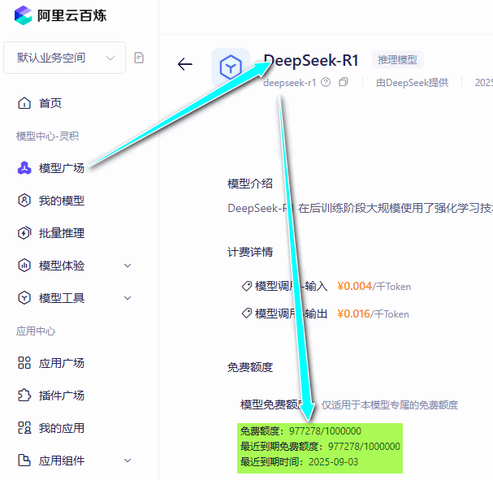
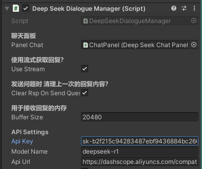

# Use Deep Seek in Unity3d
## Introduction
Want use deepSeek in unity ? 

And use stream to get the rsp data ?

This is for You.

This project is produce at [Unity 接入 DeepSeek 实现 AI 对话功能](https://mp.weixin.qq.com/s/gsKhgVp25f6h4pYcMImexA)

And use stream to request deepseek instead of waiting for long time !
## Unity 2020.3.9f1c1 

## API([aliyun](https://bailian.console.aliyun.com/?spm=a2c4g.11186623.0.0.13c7657bRaapwv#/model-market/detail/deepseek-r1))
- url: https://dashscope.aliyuncs.com/compatible-mode/v1/chat/completions
- modelName: deepseek-r1
> [!INFO] Aliyun gave all user 1000,000 tokens for free ! \
> [基于百炼调用 DeepSeek-R1 满血版 API，享100万免费token](https://www.aliyun.com/solution/tech-solution/deepseek-r1-for-platforms)
> 

## UseAge 
### 1. Set you API Key in the panel

### 2. Set the apiurl or model name
I used the [aliyun](https://bailian.console.aliyun.com/?spm=a2c4g.11186623.0.0.13c7657bRaapwv#/model-market/detail/deepseek-r1) deepseek api, so the url and model name in the panel is for aliyun.
If you use other api, you can set the apiurl and model name in the panel.

## Request with stream
<video controls src="RequestDeepSeekWithStream.mp4"/>